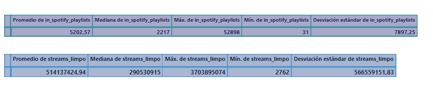

# Aplicar medidas de dispersión

## Meta

Aplicar medidas de dispersión

## Objetivo

Calcular medidas de dispersión a través de la desviación estándar.

## Objetivo individual

* [x] Cada una debe calcular para la variable que estaba trabajando anteriormente.
* [x] Muy importante también, además de calcular, es compartir las conclusiones

<figure><figcaption></figcaption></figure>

## Conclusiones

* <mark style="background-color:green;">Se realiza las medidas de desviación estándar en las variables de Spotify\_playlists y en la variable de Streams\_limpos.</mark>
* <mark style="background-color:green;">La desviación estándar es una herramienta importante para comprender la variabilidad y la consistencia en un conjunto de datos y se ve en el resultado de los datos en las dos variables que la desviación estándar es mayor esto significa que los datos son más dispersos en función al promedió.</mark>
